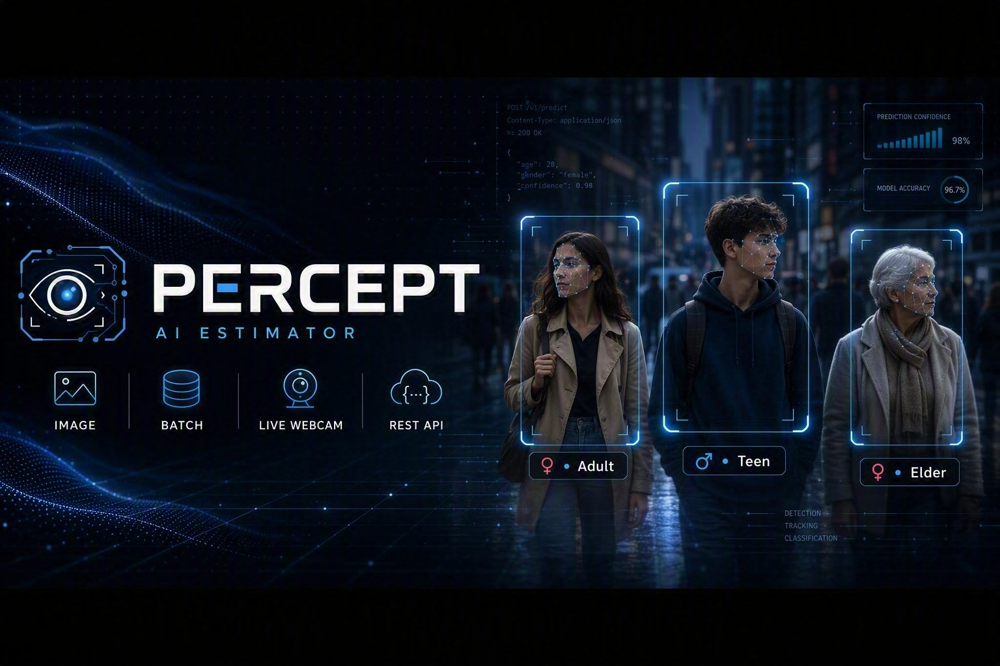
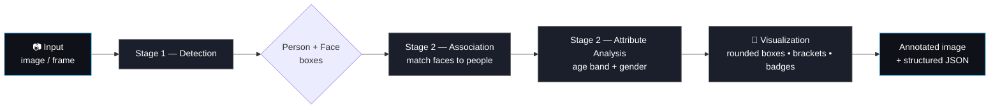

<div align="center">



# PDC — Person Detector & Classifier

**Detect every person and face in an image, then estimate age band and gender —
on a single photo, a whole folder, a live webcam feed, or through a REST API.**

[](https://www.python.org/)
[](LICENSE)
[](Dockerfile)
[](api/app.py)
[](tests/)

[Quickstart](#-quickstart) •
[Usage](#-usage) •
[Configuration](#-configuration) •
[Deploying Online](#-deploying-online) •
[Hosting Weights for Free](#-hosting-model-weights-for-free) •
[FAQ](#-faq--troubleshooting)

</div>

---

## ✨ What It Does

PDC is a ready-to-deploy computer vision pipeline built around a simple idea:
**find the people, find their faces, understand who's in the picture.**

Point it at an image, a folder of images, or a webcam, and it will:

1. 🧍 **Detect** every person and every visible face in the frame
2. 🔗 **Associate** each face with the person it belongs to
3. 🧠 **Estimate** each person's age band (`Child` / `Teen` / `Adult` / `Elder`) and gender
4. 🎨 **Render** the results as clean, floating, auto-positioned labels — no clutter, no overlapping boxes
5. 📦 **Return** the same information as structured JSON, ready to plug into any application

The same visual style — soft rounded person outlines, corner-bracket face markers, and
smart badge placement that dodges faces and canvas edges — is identical across every
inference path in this repository.

---

## 🧩 Architecture

PDC is a two-stage pipeline. A detection stage finds *where* people and faces are;
an analysis stage looks at each person (and their face, if visible) to estimate
*who* they are.



People without a clearly visible face are still analyzed — the model gracefully
falls back to body-only estimation, and the pipeline reports which mode was used
for each person.

Every inference surface below (CLI, batch, webcam, API) calls the exact same
pipeline object, so results and visuals are guaranteed to be identical no matter
how you run it.

---

## 🚀 Quickstart

### 1. Clone and install

```bash
git clone <your-repository-url>
cd pdc-person-detector-classifier

python -m venv .venv && source .venv/bin/activate   # optional but recommended
pip install -r requirements.txt
```

> Want the live webcam preview window? Also run:
> `pip install -r requirements-webcam.txt`
> (the headless OpenCV build in `requirements.txt` doesn't include a display backend)

### 2. Add the model weights

Place your two model files inside `models/`:

```
models/
├── detection_engine.pt
└── analysis_engine.onnx
```

No local copy handy? PDC can fetch them automatically — see
[Hosting Model Weights for Free](#-hosting-model-weights-for-free) and
[`models/README.md`](models/README.md) for the two auto-download options.

### 3. Run it

```bash
python scripts/infer_image.py --input examples/images/sample.jpg
```

That's it — an annotated image lands in `results/`.

---

## 📖 Usage

<details open>
<summary><strong>🖼️ Single Image</strong></summary>

```bash
python scripts/infer_image.py --input photo.jpg
```

Saves `results/photo_annotated.jpg` and opens a preview window. Add `--no-display`
on headless machines/servers.

</details>

<details>
<summary><strong>🗂️ Batch — a whole folder of images</strong></summary>

```bash
python scripts/infer_image.py --input ./my_photos --output-dir ./results
```

Every `.jpg`, `.jpeg`, `.png`, `.bmp`, and `.webp` file in the folder is processed
in sequence, with a per-file log line showing person/face counts and timing.

Want a single machine-readable report for the whole batch?

```bash
python scripts/infer_image.py --input ./my_photos --json report.json --no-display
```

`report.json` contains, for every image: the annotated output path, per-person
bounding boxes, estimated age, gender, and stage-by-stage timing in milliseconds.

</details>

<details>
<summary><strong>🎥 Live Webcam</strong></summary>

```bash
python scripts/infer_webcam.py
```

Runs live inference on your default camera with the exact same visualization
used for still images, plus a heads-up display showing FPS and person count.

| Key | Action |
|---|---|
| `q` / `Esc` | Quit |
| `s` | Save a snapshot of the current frame |
| `Space` | Pause / resume |

**Useful flags:**

```bash
python scripts/infer_webcam.py --source 1                # use a second camera
python scripts/infer_webcam.py --source path/to/clip.mp4 # analyze a video file
python scripts/infer_webcam.py --record session.mp4       # save the annotated stream
python scripts/infer_webcam.py --skip-frames 2             # analyze every 3rd frame, for higher FPS on modest hardware
python scripts/infer_webcam.py --device cuda                # use a GPU if available
```

</details>

<details>
<summary><strong>🌐 REST API — online / production inference</strong></summary>

Start the API locally:

```bash
uvicorn api.app:app --host 0.0.0.0 --port 8000
```

or with Docker:

```bash
docker build -t pdc-api .
docker run -p 8000:8000 pdc-api
```

Send an image, get structured results back:

```bash
curl -X POST "http://localhost:8000/infer?include_image=true" \
     -F "file=@photo.jpg"
```

```jsonc
{
  "person_count": 2,
  "face_count": 2,
  "people": [
    {
      "person_index": 0,
      "person": { "box": [102, 44, 390, 720], "confidence": 0.94, "class_name": "person" },
      "face":   { "box": [180, 60, 260, 150],  "confidence": 0.91, "class_name": "face" },
      "analysis": {
        "estimated_age": 27.8,
        "gender_probability": 0.87,
        "category_index": 1,
        "gender_label": "F",
        "age_band": "Adult",
        "face_available": true
      }
    }
  ],
  "timing_ms": { "load": 2.1, "detect": 18.4, "analyze": 9.7, "render": 4.2, "total": 34.4 },
  "annotated_image_base64": "..."
}
```

Interactive API docs (Swagger UI) are available at `http://localhost:8000/docs`
as soon as the service is running.

</details>

<details>
<summary><strong>🐍 Use it as a Python library</strong></summary>

```python
from pdc import PDCPipeline, PDCConfig

pipeline = PDCPipeline(PDCConfig.load())
result = pipeline.process_image("photo.jpg")

print(f"{result.person_count} people, {result.face_count} faces")
result.annotated_image.save("annotated.jpg")

for person in result.analysis_results:
    print(person.as_dict())
```

</details>

---

## ⚙️ Configuration

Every tunable value lives in [`config/default.yaml`](config/default.yaml) — nothing
is hard-coded. Point any script or the API at a custom file with `--config path.yaml`,
or override individual values with environment variables.

| Setting | Env override | Default | Description |
|---|---|---|---|
| `model.detection_confidence` | `PDC_DETECTION_CONFIDENCE` | `0.25` | Minimum confidence to keep a detection |
| `model.detection_iou` | `PDC_DETECTION_IOU` | `0.45` | IoU threshold for de-duplicating overlapping boxes |
| `model.device` | `PDC_DEVICE` | `auto` | `cpu`, `cuda`, or `auto` |
| `model.hf_repo_id` | `PDC_HF_REPO_ID` | `null` | Hugging Face repo to auto-download weights from |
| `webcam.process_every_n_frames` | — | `1` | Analyze every Nth frame for higher live FPS |
| `webcam.mirror` | — | `true` | Flip the camera feed for a natural selfie view |
| `visualization.age_bins` | — | `Child ≤11, Teen ≤20, Adult ≤50, Elder` | Age band boundaries |

See the fully-commented [`config/default.yaml`](config/default.yaml) for the complete list.

---

## 🗂️ Repository Structure

```
pdc-person-detector-classifier/
├── src/pdc/                 # Core pipeline package
│   ├── config.py             # Typed, YAML + env-driven configuration
│   ├── detector.py           # Stage 1 — person & face detection
│   ├── analyzer.py           # Stage 2 — age & gender estimation
│   ├── association.py        # Face-to-person matching
│   ├── visualization.py      # Rounded boxes, face brackets, floating badges
│   ├── pipeline.py           # Orchestrates the full pipeline end-to-end
│   └── model_hub.py          # Local / URL / Hugging Face weight resolution
├── scripts/
│   ├── infer_image.py        # Single-image & batch CLI
│   ├── infer_webcam.py       # Live webcam / video inference
│   └── download_models.py    # Pre-fetch model weights
├── api/
│   ├── app.py                 # FastAPI service
│   └── schemas.py             # Request/response models
├── config/default.yaml        # All tunable settings
├── models/                    # Place or auto-download weights here
├── tests/                      # pytest unit tests
├── Dockerfile
└── requirements*.txt
```

---

## ☁️ Deploying Online

The `api/` folder is a self-contained FastAPI service — build it once with the
included `Dockerfile` and run it anywhere that runs containers. A few good,
low-effort options depending on your budget and traffic:

| Platform | Good for | Free tier |
|---|---|---|
| **Hugging Face Spaces** (Docker SDK) | Fastest way to get a public demo/API live | ✅ Free CPU hosting |
| **Render / Railway / Fly.io** | Small production APIs with autoscaling | ✅ Free/low-cost starter tiers |
| **A VPS (Hetzner, DigitalOcean, etc.)** | Full control, predictable cost | 💲 Cheap, no cold starts |
| **AWS / GCP / Azure container services** | Enterprise scale, GPU access | 💲 Pay-as-you-go |

For latency-sensitive use cases, keep the container warm (avoid scale-to-zero
tiers) and enable GPU inference (`requirements-gpu.txt`, `device: cuda`) if
your host provides one.

---

## 📦 Hosting Model Weights for Free

Your trained weights (`detection_engine.pt` + `analysis_engine.onnx`) shouldn't
live in git — they're binary, they're large, and git handles that poorly. PDC's
`model_hub` module can fetch them automatically from wherever you host them.
Here's how the free options compare:

| Option | Free storage | File size limit | Speed | Best for |
|---|---|---|---|---|
| **🤗 Hugging Face Hub** (recommended) | Free & effectively unlimited for public repos | No hard per-file limit | Fast global CDN, purpose-built for ML weights | **Best default choice** — versioned, one-line download via `huggingface_hub`, works great with private repos too |
| **GitHub Releases** | Free | 2 GB per file | Good (Fastly-backed CDN) | Simple projects already living on GitHub; split larger files |
| **Cloudflare R2** | Free tier (10 GB storage, no egress fees) | Practically unbounded | Very fast, zero-egress-cost CDN | Teams wanting full control over a private, branded download URL |

**Recommendation:** upload both files to a Hugging Face Hub model repo and set
`hf_repo_id` in `config/default.yaml` (or `PDC_HF_REPO_ID`). Every script and the
API will transparently download and cache the weights on first run — zero manual
setup on any new machine. Full steps are in [`models/README.md`](models/README.md).

---

## 🧪 Testing

```bash
pytest -v
```

Unit tests cover the pure-logic components (association math, age banding, badge
placement) and don't require the model weights to be present, so they run cleanly
in CI on every push (see [`.github/workflows/ci.yml`](.github/workflows/ci.yml)).

---

## 🔧 Performance Tips

- **CPU-only?** Lower `analysis_input_size` slightly or increase
  `webcam.process_every_n_frames` for smoother live video.
- **Have a GPU?** Install `requirements-gpu.txt` and set `device: cuda` — both
  the detector and the analyzer will use it automatically.
- **Batch jobs:** the pipeline loads both models once and reuses them across every
  image, so batch throughput scales with hardware, not model load time.

---

## ❓ FAQ / Troubleshooting

<details>
<summary><strong>The webcam window doesn't open / cv2.imshow fails.</strong></summary>

Install the GUI-enabled OpenCV build: `pip install -r requirements-webcam.txt`.
The default `requirements.txt` uses a headless build so the project installs
cleanly on servers and in Docker.
</details>

<details>
<summary><strong>"Model weight was not found" error.</strong></summary>

Place the two files in `models/`, or configure `hf_repo_id` /
`*_weights_url` in `config/default.yaml` and run
`python scripts/download_models.py`. See [`models/README.md`](models/README.md).
</details>

<details>
<summary><strong>Can I change what counts as "Teen" vs "Adult"?</strong></summary>

Yes — edit `visualization.age_bins` in `config/default.yaml`. No code changes needed.
</details>

<details>
<summary><strong>Does this work on group photos with many people?</strong></summary>

Yes — every detected person is analyzed independently, and each is matched to
their own face (if visible) before analysis.
</details>

---

## 🔒 License & Confidentiality

This software, including the packaged pipeline and any accompanying trained
model weights, is proprietary and confidential. See [`LICENSE`](LICENSE) for
full terms. Do not redistribute without authorization.

<div align="center">

Built with 🧠 by your computer vision team.

</div>
